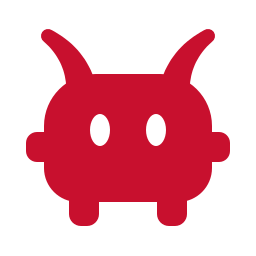

<div align="center">



# Vorcall

**Um chat de voz e texto pequeno e auto-hospedado, para quem já se conhece.**

Canais de texto e voz, compartilhamento de tela, DMs, cargos e permissões — num servidor
que é seu, para um grupo que você convida na mão.

[](https://github.com/freedomiit/freedom.vorcall/actions/workflows/ci.yml)
[](LICENSE)
[](https://github.com/freedomiit/freedom.vorcall/releases/latest)

[English](README.md) · **Português (BR)**

</div>

---

## O que é

O Vorcall é um servidor de chat e um cliente desktop para um grupo de amigos — uma turma de
jogo, um grupo de estudo, um time pequeno. Um servidor só, apenas por convite, sem
diretório para navegar e sem comunidade para descobrir. O servidor é seu; ninguém mais
consegue ler o que acontece nele.

Ele é pequeno de propósito. Não há federação, nem sistema de plugins, nem API de bots, nem
aplicativo móvel. O que há:

- **Canais de texto e de voz**, agrupados em categorias, além de DMs entre duas pessoas.
- **Voz** em todo canal de voz e em toda DM: push-to-talk ou ativação por voz, cancelamento
  de eco, supressão de ruído, volume por pessoa, orador prioritário.
- **Compartilhamento de tela** — um monitor ou uma janela só, com o áudio dela, assistido
  por quem mais estiver no canal.
- **Cargos e permissões**: 21 delas, com cores, ícones e hierarquia, sobrescrevíveis por
  canal e por membro.
- **Mensagens** com resposta, edição, reações e anexos de qualquer tipo de arquivo — até
  2 GiB guardados no servidor, e o que passar disso vai direto da máquina de quem
  enviou; texto selecionável, links clicáveis, colar um arquivo para anexar; contadores de
  não lidas e de menções; `@everyone` e `@here`.
- **Perfis**: avatar, banner, apelido, descrição, cor de destaque.
- **Moderação**: expulsar, banir, silenciar e ensurdecer no servidor, mover, revogar
  convites.
- **Um cliente desktop nativo** para Linux, Windows e macOS — Rust e `iced`, não um
  navegador embrulhado. Com temas, alternador rápido e teclas remapeáveis.

Ausentes de propósito: mais de um servidor por instalação, DMs em grupo, tópicos, busca em
mensagens, fixados, status personalizado, OAuth ou 2FA, e qualquer interface web.

## Instalar o cliente

Baixe a versão mais recente para a sua plataforma em
[**Releases**](https://github.com/freedomiit/freedom.vorcall/releases/latest):

| Plataforma | Arquivo | Observações |
| --- | --- | --- |
| Linux (x86_64) | `vorcall-linux-x86_64.tar.gz` | `tar xzf …` e depois `vorcall-linux-x86_64/install.sh` — instala em `~/.local`, sem root. Precisa de PipeWire. |
| Windows (x86_64) | `vorcall-windows-x86_64-setup.exe` | Instala por usuário, sem pedir administrador. No SmartScreen: "Mais informações" → "Executar assim mesmo". |
| macOS (Apple Silicon) | `vorcall-macos-aarch64.dmg` | Arraste para Aplicativos. Assinado ad-hoc, então a primeira abertura pede clique direito → Abrir. macOS 13+. |

O cliente se atualiza sozinho a partir do servidor ao qual está conectado, então esse
download é passo único para quem usa um servidor que publica versões. Veja
[Atualizações do cliente](docs/self-hosting.pt-BR.md#atualizações-do-cliente) para o que
isso significa quando o servidor é seu.

Prefere compilar? Veja [docs/development.md](docs/development.md) (em inglês).

## Rodar o seu próprio servidor

Você precisa de uma máquina com Docker e cerca de 1 GB de memória livre. Então:

```bash
git clone https://github.com/freedomiit/freedom.vorcall.git
cd freedom.vorcall
docker compose up -d
```

É essa a instalação inteira. Isso compila o backend a partir do código, sobe o PostgreSQL
ao lado dele, aplica as migrações e gera os dois segredos que não têm um padrão seguro.

**Leia a chave de porta que foi gerada** — todo cliente precisa dela para chegar ao seu
servidor:

```bash
docker compose logs backend | grep "Server key"
```

**Crie o primeiro convite.** Contas são só por convite, e a primeira conta a se registrar
vira a dona do servidor:

```bash
docker compose exec backend dotnet Vorcall.Server.dll invites new
```

**Conecte.** Na tela de entrada do cliente, abra a seção **Server**, coloque o seu endereço
e a chave de porta, e então crie a conta com o código de convite.

Por padrão o servidor escuta em `127.0.0.1:5000` e só é alcançável daquela máquina — que é
o que se quer atrás de um proxy reverso. Para colocá-lo na internet com domínio e TLS, e
para backups, atualizações e cada opção de configuração, leia:

### 📘 [**docs/self-hosting.pt-BR.md**](docs/self-hosting.pt-BR.md) · [in English](docs/self-hosting.md)

## Como as peças se encaixam

```
┌──────────────────┐        WebSocket (quadros protobuf)       ┌──────────────────┐
│ Cliente desktop  │ ───────────────────────────────────────▶  │                  │
│                  │      REST (login, uploads, histórico)     │   ASP.NET Core   │
│   Rust + iced    │ ───────────────────────────────────────▶  │     backend      │
│                  │                                           │                  │
│  voz · tela      │      Relay de mídia UDP (criptografado)   │   .NET 10        │
│                  │ ◀───────────────────────────────────────▶ │                  │
└──────────────────┘                                           └────────┬─────────┘
                                                                        │
                                                               ┌────────▼─────────┐
                                                               │    PostgreSQL    │
                                                               └──────────────────┘
```

Um único WebSocket carrega todos os eventos ao vivo. Áudio, vídeo e áudio de tela vão por
um relay UDP separado, porque um proxy reverso não consegue carregá-los e latência importa.
Os dois lados geram o próprio código a partir do mesmo
[`proto/vorcall.proto`](proto/vorcall.proto).

| | |
| --- | --- |
| `server/` | ASP.NET Core (.NET 10) — API, motor de permissões, relay de voz |
| `client/` | Workspace Cargo — o app desktop em `iced` e seus crates de mídia |
| `proto/` | O esquema compartilhado que os dois lados compilam |
| `tests/` | Suíte xunit: matriz de permissões, protocolo, superfície REST |
| `deploy/` | Configurações nginx e provisionamento para uma instalação de produção |

## Documentação

A documentação técnica é mantida em inglês, para que quem contribui de qualquer lugar
consiga acompanhar. O guia de auto-hospedagem também está em português.

| | |
| --- | --- |
| [**Auto-hospedagem**](docs/self-hosting.pt-BR.md) | Instalar, expor, configurar, fazer backup e atualizar um servidor |
| [**Desenvolvimento**](docs/development.md) | Compilar, rodar localmente, a suíte de testes e os gates |
| [**Protocolo**](PROTOCOL.md) | Quadros, máquinas de estado, resolução de permissões, limites |
| [**Administração**](docs/administration.md) | A CLI de admin: convites, contas, propriedade do servidor |
| [**Publicação**](docs/releasing.md) | Para mantenedores: assinar e publicar uma versão do cliente |

## Contribuindo

Issues e pull requests são bem-vindos — veja [CONTRIBUTING.md](CONTRIBUTING.md) para saber
como compilar o projeto e quais são os gates. Problemas de segurança vão para
[SECURITY.md](SECURITY.md), nunca para uma issue pública.

## Licença

[MIT](LICENSE) © Freedom IT
